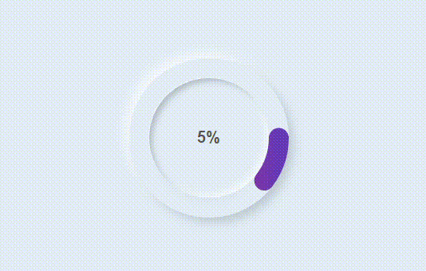

# Circular Progress Bar 🔄

## Overview
The *Circular Progress Bar* is a visually appealing web component that represents progress using a circular design. The circular bar is filled based on the progress percentage, providing a dynamic and interactive user experience.

## Technologies Used 🚀
- **HTML**
- **CSS**
- **JavaScript**
- **SVG**

## Features 🌟
- Circular design for a modern and aesthetic progress representation.
- Gradient color scheme for a visually appealing look.
- Dynamic updating of the progress percentage.

## Usage 💻
1. The circular progress bar fills based on the progress percentage.
2. The percentage is displayed at the center of the circular bar.

## Live Demo 🌐
Check out the live demo: [Circular Progress Bar Demo](https://circular-progress-bar-beige.vercel.app)

## Installation 🛠️
1. Clone the repository: `git clone https://github.com/Eraycann/Circular-Progress-Bar`
2. Open the project folder in your code editor.
3. Launch the `index.html` file in a web browser.

## Customization 🎨
- Adjust the progress percentage in the JavaScript code (`<script>` section) to represent different levels of completion.
- Customize the styling in `style.css` to match your design preferences.

## Contributing 🤝
Contributions are welcome! Feel free to enhance the design, add new features, or fix any issues. Open a pull request to contribute.

## License 📜
This project is licensed under the [MIT License](LICENSE.md).

## Author ✨
- Eraycan Sivri
- Contact: eraycansivri@hotmail.com

Enjoy using the Circular Progress Bar!
